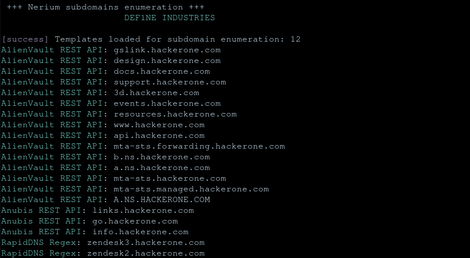

# subnerium

[](https://github.com/d3f1ne/)
[](https://github.com/d3f1ne/)

subnerium is a fast passive subdomain enumeration tool that uses various sources to gather data.<br>
All requests are made through yaml templates, to see more see the documentation:


## Download

```
git clone https://github.com/d3f1ne/subnerium
```

## Install


You can install it by typing:

```
chmod +x install.sh
./install.sh
```

## Run

```
Note: Use API keys to get great results.
subnerium -h
```

## APIs Used

- [alienvault](https://github.com/d3f1ne/subnerium)
- [anubis](https://github.com/d3f1ne/subnerium)
- [binaryedge](https://github.com/d3f1ne/subnerium)
- [cerspotter](https://github.com/d3f1ne/subnerium)
- [crtsh](https://github.com/d3f1ne/subnerium)
- [hackertarget](https://github.com/d3f1ne/subnerium)
- [rapiddns](https://github.com/d3f1ne/subnerium)
- [securitytrails](https://github.com/d3f1ne/subnerium)
- [urlscan](https://github.com/d3f1ne/subnerium)
- [virustotal](https://github.com/d3f1ne/subnerium)
- [webarchive](https://github.com/d3f1ne/subnerium)
- [whoisxml](https://github.com/d3f1ne/subnerium)
- [shodan](https://github.com/d3f1ne/subnerium)
- [fullhunt.io](https://github.com/d3f1ne/subnerium)
- [bevigil](https://github.com/d3f1ne/subnerium)


### Disclaimer

> This tool is only for testing and academic purposes and can only be used where strict consent has been given. Do not use it for illegal purposes! It is the end user’s responsibility to obey all applicable local, state and federal laws. Developers assume no liability and are not responsible for any misuse or damage caused by this tool and software.

### Missing 
- [x] Install.sh 21/04/2023
- [ ] API key rotation after expiring
- [x] Save the result with the -o option 21/04/2023
- [ ] Filter junk domains
- [ ] Create the documentation
- [ ] Create an option to valide and add templates
## License

#This project is licensed under the GPL 3 License - see the LICENSE file for details
